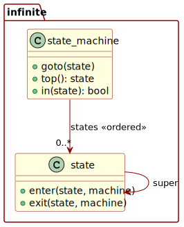
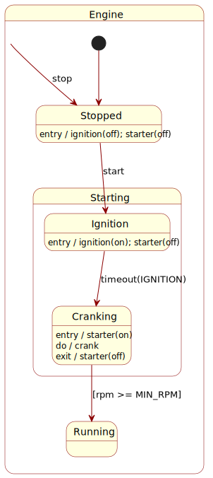

# Infinite State Machine

The following presents a hierarchical (nested) state machine
implementation in C.

<div id="fig-infinite-state-machine">



Figure 1: The infinite state machine concept in Unified Modelling
Language

</div>

The concept applies a separation of concerns. The ‘machine’ and the
‘topology’ of its states occupy distinct yet interrelated aspects. The
machine is a run-time entity that manages state transitions, while the
topology defines the structural relationships between states. One is
dynamic, the other is ordinarily static and pre-defined. Transitions and
actions applied to the machine serve as operational mechanisms that
manipulate the machine by walking the topology, triggering actions along
the way.

## Introduction

Why infinite? “Infinite” refers to the absence of intrinsic compile-time
nesting limits aside from memory or configured maximum depth in the C
variant. It also implies that the system can handle an unbounded number
of states and transitions, making it highly flexible and adaptable. The
design also supports unbounded state topologies. Such can be flat or
hierarchical, allowing for more complex state relationships.
Additionally, the state machine can manage an unbounded number of active
states simultaneously, allowing for concurrent state management with
overlapping topologies as needed.

“Topology” here refers to the arrangement and organisation of states
within the state machine. This can include hierarchical relationships,
where states are nested within one another, for more complex
arrangements that offer greater flexibility and adaptability—states
within states *ad aeternum*.

Finally, the term “infinite” acts as a play on words, suggesting
limitless possibilities versus finite constraints.

## C Implementation for Deeply-Embedded Systems

Think of C as the lingua Franca of computing. If you can express it in
C, you can express it anywhere.

Use simple language elements: integers, structures, arrays and pointers.
This makes it suitable for deeply embedded systems with limited
resources, and it is also helpful in designing a portable framework. C
constructs typically have their analogues in other languages, making it
easier to translate ideas across different platforms.

### Data structures

Translating the design to C gives the following data structures:

``` c
struct infinite_state {
    struct infinite_state *super; // parent (NULL for root)
    void (*enter)(struct infinite_state *, struct infinite_state_machine *); // optional
    void (*exit)(struct infinite_state *, struct infinite_state_machine *);  // optional
};

struct infinite_state_machine {
    struct infinite_state *states[INFINITE_STATE_MACHINE_MAX_DEPTH];
    int depth; // 0..INFINITE_STATE_MACHINE_MAX_DEPTH
};
```

The maximum depth defaults to 7, unless it has already been defined
before the inclusion point of the header. Why 7? There is a method to
the choice of a maximum depth of 7. Pointers and integers are 32 bits
wide on a 32-bit machine. Seven pointers and one integer occupy eight
words, or 32 bytes on a typical microcontroller. If a single machine
requires more than seven nesting levels, it is generally better to
refactor the design to reduce complexity.

### Lifecycle and core operations

| Function | Description |
|----|----|
| `void infinite_state_machine_init(machine)` | Clear machine (depth=0, state slots NULL) |
| `void infinite_state_machine_goto(machine, state)` | LCA-optimised transition to `state` (may be NULL: no-op) |
| `void infinite_state_machine_jump(machine, state)` | Rebuild the stack from scratch, from root to `state,` ignoring callbacks |
| `int infinite_state_machine_in(machine, state)` | 1 if active; 0 if not; negative `-EINVAL` on invalid arguments |
| `struct infinite_state *infinite_state_machine_top(machine)` | Current innermost state or NULL |
| `struct infinite_state **infinite_state_topology(state, depth, vec)` | Helper producing forward topology (outer to inner) |

LCA stands for “least common ancestor.” It is an optimisation technique
used to improve the efficiency of state transitions within the state
machine. By identifying the least common ancestor of the current state
and the target state, the state machine can skip unnecessary
intermediate states, resulting in faster transitions and reduced
overhead.

LCA improves:

- Transitioning from a nested state to a sibling state without going
  through the parent state.
- Skipping intermediate states when transitioning back to a previously
  active state.
- Optimising transitions between states with complex hierarchical
  relationships.

The core “goto” operation applies the optimisation, as follows.

``` c
/*!
 * \brief Goes to a state in the infinite state machine.
 * \param machine The infinite state machine.
 * \param state The state to enter.
 *
 * Going to a state in the infinite state machine transitions the machine to the
 * new state. This will push the current state onto the stack and transition to
 * the new state. If the new state is the same as the current state, no action
 * is taken; likewise, if the new state is \c{NULL}, no action is taken.
 * Otherwise, all the exit actions for the current state are run, and the new
 * state is entered by running all enter actions.
 *
 * \note O(n) time complexity applies, where n is the depth of the state machine.
 */
void infinite_state_machine_goto(struct infinite_state_machine *machine, struct infinite_state *state)
{
    if (state == infinite_state_machine_top(machine))
    {
        return;
    }
    struct infinite_state_machine jump;
    infinite_state_machine_jump(&jump, state);
    int depth = 0;
    while (depth < machine->depth && depth < jump.depth && machine->states[depth] == jump.states[depth])
    {
        depth++;
    }
    while (machine->depth > depth)
    {
        infinite_state_machine_exit(machine);
    }
    while (jump.depth > depth)
    {
        infinite_state_machine_enter(machine, jump.states[depth++]);
    }
}
```

The implementation uses a little trick. By leveraging the concept of a
“jump” state machine, the “go” operator can effectively manage state
transitions without the overhead of maintaining a whole stack of states.
This enables more efficient transitions, particularly in scenarios with
complex state hierarchies. The jump state machine serves as a
lightweight alternative, allowing for quick adjustments to the state
without the need for extensive bookkeeping.

## Usage

The following example models a simple engine with the states: stopped,
starting, igniting, cranking, and running. It demonstrates the use of
the infinite state machine to manage the engine’s state transitions.

The engine starts in the stopped state. When the `start` function is
called, it transitions to the starting state, which then enters the
igniting state. The engine cycles through the igniting and cranking
states before reaching the running state. The `stop` function can be
called at any time to transition back to the stopped state.

Igniting and cranking exist as sub-states of “starting.” The engine
takes time to transition between these states, simulating the various
phases of starting an engine: switch on the ignition for a moment, then
crank the engine until it starts.

<div id="fig-engine">



Figure 2: Engine in Unified Modelling Language

</div>

Implemented in C:

``` c
#include "infinite_state_machine.h"

#include <stdbool.h>
#include <assert.h>

static void engine_cycle(void);
static void igniting_cycle(void);
static void cranking_cycle(void);

static void starting_enter(struct infinite_state *state, struct infinite_state_machine *machine);
static void igniting_enter(struct infinite_state *state, struct infinite_state_machine *machine);
static void cranking_enter(struct infinite_state *state, struct infinite_state_machine *machine);

struct engine
{
    struct infinite_state state;
    void (*cycle)(void);
};

struct starting
{
    struct engine engine;
    int cycling;
};

/*
 * Initialise the engine state topology.
 */
static struct engine stopped = {.cycle = engine_cycle};
static struct engine starting = {.state.enter = starting_enter, .cycle = engine_cycle};
static struct starting igniting = {.engine =
    {.state.super = &starting.state, .state.enter = igniting_enter, .cycle = igniting_cycle}};
static struct starting cranking = {.engine =
    {.state.super = &starting.state, .state.enter = cranking_enter, .cycle = cranking_cycle}};
static struct engine running = {.cycle = engine_cycle};

static struct infinite_state_machine engine;

static void go(struct engine *to)
{
    infinite_state_machine_goto(&engine, &to->state);
}

/*
 * Check if the engine is in a specific state or super-state.
 */
static bool in(struct engine *in)
{
    return infinite_state_machine_in(&engine, &in->state) == 1;
}

/*
 * Start the engine. This is an external event.
 * Transition from the stopped state to the starting state.
 */
void start(void)
{
    if (in(&stopped))
    {
        go(&starting);
    }
}

/*
 * Stop the engine, an external event.
 * Transition from the any state to the stopped state.
 */
void stop(void)
{
    go(&stopped);
}

/*
 * Cycle the engine's top state.
 * This takes advantage of the fact that the engine's states are all of the same
 * type. It assumes that the top state is always an engine structure and that
 * the structure's first member is the infinite_state base structure. It also
 * assumes that the cycle function is implemented for each engine state.
 */
static void cycle(void)
{
    ((struct engine *)infinite_state_machine_top(&engine))->cycle();
}

/*
 * Test the infinite state machine.
 */
int test_engine()
{
    /*
     * Strictly speaking, the machine does not require initialisation.
     * It lives in "blank static storage." The C run-time automatically initialises
     * all static and global variables to zero. In other words, C has already initialised
     * the machine for us.
     */
    infinite_state_machine_init(&engine);

    /*
     * Set up the engine by applying the initial transition.
     */
    go(&stopped);

    assert(in(&stopped));
    start();
    assert(in(&starting));
    assert(in(&igniting.engine));
    cycle();
    assert(in(&starting));
    assert(in(&cranking.engine));
    cycle();
    assert(in(&starting));
    assert(in(&cranking.engine));
    cycle();
    assert(in(&running));
    stop();
    assert(in(&stopped));

    return 0;
}

static void engine_cycle(void) {}

static void igniting_cycle(void)
{
    if (--igniting.cycling == 0)
    {
        go(&cranking.engine);
    }
}

static void cranking_cycle(void)
{
    if (--cranking.cycling == 0)
    {
        go(&running);
    }
}

static void starting_enter(struct infinite_state *state, struct infinite_state_machine *machine)
{
    go(&igniting.engine);
}

static void igniting_enter(struct infinite_state *state, struct infinite_state_machine *machine)
{
    igniting.cycling = 1;
}

static void cranking_enter(struct infinite_state *state, struct infinite_state_machine *machine)
{
    cranking.cycling = 2;
}
```

The example flow proceeds as follows:

1.  Enter “starting” and immediately go to “igniting”.
2.  Enter “igniting” and set cycling to 1.
3.  Each cycle, decrement cycling. When zero, go to “cranking”.
4.  Enter “cranking” and set cycling to 2.
5.  Each cycle, decrement cycling. When zero, go to “running”.

## Conclusions

The concept of a state machine is ubiquitous in computer science and
engineering. Its principles can be applied across various domains, from
embedded systems to high-level application design. The infinite state
machine model presented here offers a lightweight but flexible and
robust framework for managing complex state interactions, enabling
developers to create more adaptable and maintainable stateful systems.

The C implementation is particularly well-suited for deeply embedded
systems, where resources are limited, and efficiency is paramount. By
leveraging simple data structures and core operations, this design can
be easily adapted to a wide range of applications, making it a versatile
tool in the developer’s arsenal. The risk for the developer lies in the
potential complexity of managing state transitions and ensuring the
correct behaviour of the state machine. As the system evolves,
maintaining clarity and simplicity in the state management logic becomes
crucial to avoid introducing bugs and inefficiencies.

Notably, the state machine apparatus itself has a state; call it an
auxiliary state. But in this case, the additional state is elementary:
just a single topology vector representing a ‘cursor’ within the state
hierarchy. The topology of the ‘machine’ and the machine itself exist
separately, allowing for a clean separation of concerns and easier
management of state transitions. It also means that the machine
abstraction can be modelled as a private property, or properties in the
case of multiple parallel machines, all belonging to the enclosing
concept as a whole and *not* as part of an inheritance framework. The
enclosing design can thus *fully* encapsulate the state machine’s
behaviour and interactions, providing a more robust framework for
building complex systems.

> “Divide et impera, ad aeternum regnat.”
